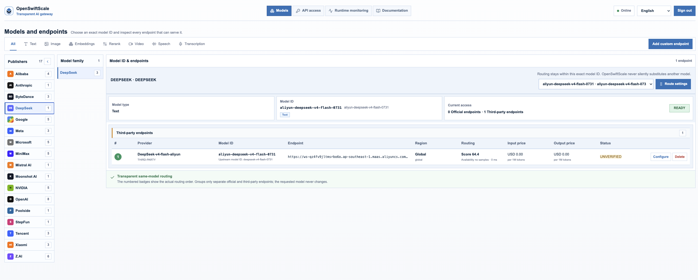

<div align="center">

# OpenSwiftScale

### Your models. Your keys. Your network.

A transparent, open-source, self-hosted AI gateway for developers.

[](https://github.com/swift-scale-ai/OpenSwiftScale/actions/workflows/ci.yml)
[](https://github.com/swift-scale-ai/OpenSwiftScale/releases)
[](LICENSE)

[Quick start](#quick-start) · [Gateway API](docs/API.md) · [Documentation](docs/README.md) · [Contributing](CONTRIBUTING.md) · [Security](SECURITY.md)

</div>

OpenSwiftScale gives developers and teams one OpenAI-compatible endpoint for directly connected model providers. It runs without a SwiftScale account, keeps provider keys inside your network, stores operational data locally, and sends no telemetry by default.



## Documentation

| Guide | Purpose |
| --- | --- |
| [Documentation home](docs/README.md) | What OpenSwiftScale is, what it does, installation, first-time setup, routing, examples, and troubleshooting. |
| [Gateway API](docs/API.md) | Authentication, callable model IDs, SDK examples, errors, and routing headers. |
| [Configuration](docs/CONFIGURATION.md) | Runtime variables, model endpoints, API keys, and local routing. |
| [Data and storage](docs/DATA_AND_STORAGE.md) | SQLite contents, secret handling, backup, restore, reset, and retention. |
| [Operations](docs/OPERATIONS.md) | Install, start, stop, logs, upgrades, networking, and production checklist. |
| [Development](docs/DEVELOPMENT.md) | Source layout, local ports, toolchain, tests, and build workflow. |
| [Releases](docs/RELEASES.md) | Versioning, automated artifacts, container images, and verification. |
| [Architecture](docs/ARCHITECTURE.md) | Runtime components, request path, persistence model, and extension boundaries. |
| [Product design](docs/PRODUCT.md) | Product forms, principles, audience, scope, non-goals, and success criteria. |
| [Open-source policy](docs/OPEN_SOURCE.md) | License rights, self-hosted guarantees, trademarks, contributions, and dependencies. |
| [Security](SECURITY.md) | Vulnerability reporting and secure deployment baseline. |
| [Support](SUPPORT.md) | Project support scope and safe issue-reporting guidance. |
| [Code of Conduct](CODE_OF_CONDUCT.md) | Expected behavior in project spaces. |

## Why OpenSwiftScale

- **Local-first:** one container, embedded console, SQLite by default.
- **No model aggregator:** OpenSwiftScale connects directly to configured provider APIs.
- **OpenAI-compatible:** use existing OpenAI SDKs with a different base URL.
- **Observable:** local usage, estimated cost, latency, Prometheus metrics, and request IDs.
- **Transparent:** inspect the model publisher, family, exact model ID, endpoint, price, and availability in one place.
- **Predictable:** routing may change the endpoint serving an exact model ID, but never silently substitutes another model.
- **Resilient:** multiple endpoints for the same model can be tried in a visible, deterministic order.
- **Auditable:** Apache-2.0 source, reproducible releases, SBOMs, and provenance attestations.
- **Private by default:** prompt logging and telemetry are disabled.

## Quick start

Requirements: Docker Engine and Docker Compose v2.

```bash
git clone https://github.com/swift-scale-ai/OpenSwiftScale.git
cd OpenSwiftScale
./scripts/install.sh
./scripts/start.sh
```

`scripts/start.sh` checks Docker, creates missing first-run credentials, starts the container, waits for health, and prints the console address. It is safe to use the same command for later restarts. Users do not need to run Docker Compose commands directly.

The start script also detects the host's active LAN IP, publishes the gateway on that address, and prints the internal API URL. Override `OPENSWIFTSCALE_BIND_ADDRESS` and `OPENSWIFTSCALE_PUBLIC_URL` when deploying behind private DNS, a VPN, reverse proxy, or internal load balancer.

To follow gateway logs, run `./scripts/logs.sh`.

Open the console at <http://127.0.0.1:8080>. Sign in with the administrator username and randomly generated password printed by the installer. Select a model ID, configure one of its endpoints with a provider API key, then create a revocable Gateway API key from the top navigation. Saving a provider connection does not contact the provider or block startup.

When running from source with `./scripts/dev.sh`, the default console login is username `admin` and password `openswiftscale`. The standard installer does not reuse this development password; it generates and prints a random password instead.

Custom OpenAI-compatible and Anthropic-compatible endpoints can be added from the same page. Provider credentials are encrypted with AES-256-GCM before being stored in SQLite; the master key is kept separately under `/data/keys/master.key` by default.

The same exact **model ID** may be served by multiple connections. OpenSwiftScale displays those endpoints together and tries them in their visible order when an endpoint cannot connect or returns `401`, `403`, `408`, `429`, or `5xx`. It does not replace the requested model with a different model.

Send a request:

```bash
export OPEN_SWIFT_SCALE_KEY="<key-created-in-api-access>"

curl http://192.168.1.25:8080/v1/chat/completions \
  -H "Authorization: Bearer $OPEN_SWIFT_SCALE_KEY" \
  -H "Content-Type: application/json" \
  -d '{
    "model": "gpt-5.6-luna",
    "messages": [{"role": "user", "content": "Explain this architecture."}],
    "stream": false
  }'
```

See the [Gateway API guide](docs/API.md) for authentication, model discovery, SDK examples, routing behavior, response headers, and production network guidance.

For local source development:

```bash
./scripts/dev.sh
```

The development script starts both services: the Go gateway on `127.0.0.1:8080` and the Vite + React + TypeScript console on `127.0.0.1:5173`. Open the Vite address during development for automatic browser updates. API, health, readiness, and metrics requests are proxied to Go.

Port `5173` is only the development UI and is not an inference endpoint. Applications use the gateway's configured LAN or private-DNS URL on port `8080` (unless explicitly overridden).

If another local application already uses port 8080, choose a different backend address; Vite automatically proxies to it:

```bash
OPENSWIFTSCALE_LISTEN_ADDR=127.0.0.1:8081 ./scripts/dev.sh
```

The default development console login is username `admin` with password `openswiftscale`. Production installation generates a unique random administrator password instead.

Production builds remain a single self-contained Go executable. Vite writes its optimized output to `internal/webui/dist`, and Go embeds that directory at compile time:

```bash
./scripts/build.sh
```

## API surface

| Method | Endpoint | Status |
| --- | --- | --- |
| `GET` | `/v1/models` | Implemented |
| `POST` | `/v1/chat/completions` | Implemented, including SSE |
| `POST` | `/v1/responses` | Implemented for compatible providers |
| `POST` | `/v1/embeddings` | Implemented for catalog entries with embedding capability |
| `POST` | `/v1/images/generations` | Implemented for image-capable compatible providers |
| `POST` | `/v1/rerank` | Implemented for rerank-capable compatible providers |
| `POST` | `/v1/videos` | Implemented for video-capable compatible providers |
| `POST` | `/v1/audio/speech` | Implemented for speech-capable compatible providers |
| `POST` | `/v1/audio/transcriptions` | Implemented with multipart upload for transcription-capable providers |
| `GET` | `/healthz` | Implemented |
| `GET` | `/readyz` | Implemented |
| `GET` | `/metrics` | Implemented |
| `GET` | `/api/admin/providers` | Provider connections and masked key state |
| `POST` | `/api/admin/providers` | Save an official or custom connection without startup validation |
| `DELETE` | `/api/admin/providers/{id}` | Delete a custom connection |
| `GET` | `/api/admin/users` | List API users and their masked key metadata |
| `POST` | `/api/admin/users` | Create an API user |
| `PATCH` | `/api/admin/users/{id}` | Update or disable an API user |
| `DELETE` | `/api/admin/users/{id}` | Delete a user and revoke all owned keys |
| `POST` | `/api/admin/users/{id}/keys` | Issue a key; the plaintext is returned once |
| `DELETE` | `/api/admin/users/{id}/keys/{key_id}` | Revoke an API key |

The embedded console uses separate management authentication and exposes a single model-and-endpoint workspace, direct API-key creation, request history, and compact runtime health information.

## Initial model catalog

The seed catalog separates published model families from callable model routes. It covers the current public families of Alibaba, Anthropic, DeepSeek, Google, MiniMax, NVIDIA, OpenAI, Tencent, Xiaomi, and Z.AI—including multimodal families such as Wan, HappyHorse, Veo, Hailuo, Sora, and CogVideoX. Text, image, embeddings, rerank, video, speech, and transcription routes become callable when an exact model ID and compatible endpoint are configured. Families that still require a provider-specific contract remain discoverable but are not advertised by `/v1/models`. Official publisher endpoints stay separate from third-party or locally operated compatible endpoints.

OpenSwiftScale does **not** integrate with or depend on OpenRouter and does not route prompts through an aggregator. Provider model IDs, prices, context limits, and availability change independently; treat [`config/catalog.yaml`](config/catalog.yaml) as versioned seed data and verify each provider contract before production use.

## Local data

Local source development persists runtime state in `data/openswiftscale.db`. Docker deployments use the `openswiftscale_data` named volume and store the database at `/data/openswiftscale.db`. Provider credentials are encrypted before storage; managed Gateway API keys are stored only as SHA-256 hashes; prompt and response bodies are not persisted.

See [Data and storage](docs/DATA_AND_STORAGE.md) before backing up, resetting, or upgrading an installation.

## Project status

This repository contains the open-source self-hosted OpenSwiftScale runtime. Before production use, pin image digests, review provider-specific contracts, configure TLS at the ingress, test failure behavior, and establish database backups.

## License

Apache License 2.0. See [LICENSE](LICENSE).

The Apache license covers the source in this repository. “OpenSwiftScale” and its associated logos and product branding remain trademarks; see [Open-source policy](docs/OPEN_SOURCE.md).
